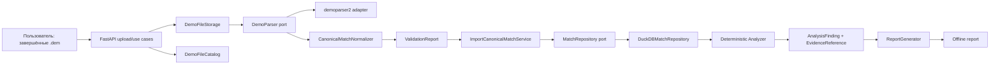

# Архитектура StratWeb MVP

Статус: этап 6.5 — Temporal Engine 1.1 read-only integration UI, 18 июля 2026 года. Документ отделяет
реализованные inspection/canonicalization/persistence/analytics/temporal компоненты
от будущей тактической и пространственной аналитики.

## 1. Цель и границы

Вход: один или несколько завершённых CS2 `.dem` файлов соперника.

Выход: воспроизводимый предматчевый отчёт о T-side, CT-side, повторениях, ошибках,
рекомендуемом ответе и нежелательных действиях. Каждый вывод должен иметь точную
ссылку на исходную демку, match, round и диапазон ticks.

Продукт не взаимодействует с запущенной игрой. Архитектура не содержит memory
reader, injector, live telemetry, overlay, input automation или online coaching.

## 2. Исследование parser-ов

### 2.1 Проверенный snapshot версий и API

Проверка проведена 17 июля 2026 года по официальным репозиториям/PyPI, а сигнатуры
дополнительно проинспектированы после установки точных релизов в изолированное
окружение CPython 3.13.

**demoparser2 0.41.4**

- PyPI: [demoparser2 0.41.4](https://pypi.org/project/demoparser2/0.41.4/).
- Source/documentation: [LaihoE/demoparser](https://github.com/LaihoE/demoparser).
- Официальный пример создаёт `DemoParser(path)` и вызывает `parse_event(...)` или
  `parse_ticks(...)`.
- В установленной версии 0.41.4 проверены методы:
  - `parse_header()`;
  - `list_game_events()` и `list_updated_fields()`;
  - `parse_event(event_name, *, player=None, other=None)`;
  - `parse_events(event_name, *, player=None, other=None)`;
  - `parse_ticks(wanted_props, *, players=None, ticks=None, prop_states=None)`;
  - `parse_grenades(*, extra=None, grenades=True)`;
  - `parse_player_info()`, `parse_item_drops()`, `parse_skins()`, `parse_voice()`.
- Heavy parsing написан на Rust; Python API возвращает dataframe-представления и
  позволяет запрашивать отдельные события/properties.
- Пакет публикует CPython wheels, включая Python 3.11–3.14 для Windows и common
  Linux/macOS platforms. Наличие wheel для фактической deployment platform всё равно
  проверяется в CI.

**Awpy 2.0.2**

- PyPI: [Awpy 2.0.2](https://pypi.org/project/awpy/2.0.2/).
- Source: [pnxenopoulos/awpy](https://github.com/pnxenopoulos/awpy).
- Parser output: [официальное описание таблиц Awpy](https://awpy.readthedocs.io/en/latest/modules/parser_output.html).
- В установленной версии проверен основной API:
  `Demo(path).parse(events=None, player_props=None, other_props=None)` и отдельные
  `parse_header`, `parse_events`, `parse_ticks`, `parse_grenades`.
- После `parse()` доступны Polars-таблицы `rounds`, `kills`, `damages`, `shots`,
  `grenades`, `smokes`, `infernos`, `bomb`, `footsteps`, `ticks` и header.
- Awpy прямо указывает, что использует demoparser2 как backend; его FAQ рекомендует
  demoparser2 для полного или специфического извлечения данных:
  [Awpy FAQ](https://awpy.readthedocs.io/en/latest/getting-started/faq.html).

Нельзя переносить примеры из Awpy 1.x или старых версий demoparser2 в adapter без
контрактного теста на зафиксированной версии.

### 2.2 Сравнение для StratWeb

| Критерий | demoparser2 0.41.4 | Awpy 2.0.2 |
|---|---|---|
| Уровень | Низкоуровневый query API событий/ticks | Готовый competitive-analysis слой |
| Backend | Rust + Python bindings | Python-обёртка поверх demoparser2 |
| Контроль полей | Высокий: явный список events/properties | Есть, но поверх defaults и post-processing |
| Готовые rounds/events | Требуют нашей нормализации | Уже собраны и очищены |
| Формат для анализа | Dataframe output, adapter конвертирует в Polars | Polars напрямую |
| Прозрачность evidence | Выше: mappings и exclusions принадлежат нам | Ниже: часть фильтров/labels делает библиотека |
| Runtime footprint | Уже тянет dataframe dependencies, но без visualization stack | Дополнительно matplotlib, scipy, networkx, pillow и др. |
| Гибкость неизвестных событий | `list_game_events`, точечные queries | FAQ направляет к demoparser2 для specific needs |
| Риск API/schema drift | Высокий, документация ограничена | Более стабильная facade, но зависит от parser backend |
| Польза для проекта | Основной extractor | Reference/verification, visualization позже при необходимости |

### 2.3 Решение

Основной parser: **`demoparser2==0.41.4`**.

Причины:

1. StratWeb нужен не только стандартный scoreboard, а точные actor/side/position/tick
   поля и возможность расширять список событий.
2. Собственная каноническая нормализация делает warmup/incomplete-round filtering и
   evidence lineage явными и тестируемыми.
3. Нет смысла добавлять второй слой поверх того же backend-а и ненужные зависимости
   визуализации в backend MVP.
4. Adapter скрывается за `stratweb.ports.DemoParser`, поэтому смена parser-а не меняет
   доменные модели, storage или analytics.

Awpy не отвергается навсегда. Его round-building semantics полезно использовать как
reference при fixture-тестах; visualization utilities можно добавить отдельным extra,
если это потребуется после MVP.

## 3. Архитектурный стиль

MVP — модульный монолит с hexagonal boundaries. Это проще разрабатывать и запускать
локально, чем набор сервисов, но не связывает domain с FastAPI, DuckDB или конкретным
parser SDK.



Зависимости направлены внутрь: adapters зависят от ports/contracts/domain, но domain
не импортирует FastAPI, DuckDB, demoparser2 или renderer.

## 4. Компоненты и ответственность

### HTTP/API

Проверяет форму запроса, ограничения размера и расширение, передаёт binary stream в
application use case. FastAPI `UploadFile` не проходит дальше API adapter-а. Будущий
upload endpoint должен возвращать отдельный статус по каждому файлу, чтобы одна
битая демка не отменяла batch.

### DemoFileStorage

Пишет stream сначала во внутренний temporary file, одновременно считает SHA-256 и
контролирует фактический byte limit. После завершения использует имя
`<uuid4.hex>.dem`; пользовательское имя никогда не участвует в path. Atomic rename
перемещает файл в private upload directory.

### DemoFileCatalog

Хранит metadata и lifecycle `uploaded -> parsing -> parsed|failed`. На `sha256`
создаётся UNIQUE constraint. При duplicate новый временный blob удаляется, а API
возвращает ссылку на существующий `DemoFile`. Гонка двух одинаковых загрузок
разрешается constraint-ом внутри transaction, а не предварительным `SELECT`.

### DemoParser adapter

Единственное место, импортирующее `demoparser2`. Adapter вызывает только проверенный
API выбранной версии, фиксирует `ParserIdentity`, превращает pandas/dataframe output
в Polars и возвращает `ParsedDemo`. Parser column names остаются raw: inspection
service может показать только их schema/count summary, а в canonical domain они не
попадают и заканчиваются на границе normalizer-а.

На этапе 2 adapter также переносит в parser-independent contract список доступных
events, optional player-info и ошибки отдельных event queries. Отсутствующий event не
является fatal error; нарушение header/event-discovery contract или неподдерживаемый
demo format является контролируемой typed error.

### DemoInspectionService и CLI

Этап 2 предоставляет read-only use case для одного локального файла. Сервис потоково
считает SHA-256, вызывает `DemoParser`, строит compact Pydantic JSON `1.1.0` и не
вызывает `parse_ticks`. CLI печатает JSON в stdout и по запросу сохраняет его в файл,
но не пишет в DuckDB и не выполняет полную canonical gameplay normalization/analytics.

Внутри inspection существует узкий parser-independent `InspectionEventNormalizer`.
Он сопоставляет `round_start|round_poststart|round_prestart|round_freeze_end` с
`CanonicalRoundStart`, а `round_end|round_officially_ended` — с
`CanonicalRoundEnd`. Ни один raw alias не является обязательным. Несколько aliases
не суммируются: выбирается приоритетный доступный source и его строки
дедуплицируются по round marker, затем по tick. Это диагностический lifecycle слой,
отдельный от полного `CanonicalMatchDataset` этапа 3.

Количество раундов определяется детерминированно в порядке надёжности:

1. глобальный `MAX(total_rounds_played)` среди всех разобранных event tables;
2. число наблюдаемых `CanonicalRoundEnd`;
3. число наблюдаемых `CanonicalRoundStart`.

Если candidates расходятся, выбранное значение и расхождение попадают в warnings.
Строки warmup исключаются, когда доступен `is_warmup_period`.

### EventNormalizer

Этап 3 реализует `CanonicalMatchNormalizer`, который возвращает versioned Pydantic
`CanonicalMatchDataset`, а не parser/DataFrame object. Внутри разрешён Polars raw
transport, но наружу выходят только собственные contracts.

Pipeline разделён на детерминированные компоненты:

1. `RoundResolver` строит границы и provenance из alias registry;
2. `PlayerResolver` объединяет только подтверждённые Steam ID;
3. `TeamResolver` отделяет физический состав от текущей T/CT side;
4. `RoundAssignmentService` централизованно назначает event window/phase;
5. `GameplayEventNormalizer` переводит kill/damage/shot/grenade/bomb rows;
6. `CanonicalDatasetValidator` независимо проверяет целостность.

Inspection `1.1.0` продолжает использовать лёгкий `InspectionEventNormalizer` и не
зависит от полного dataset contract `1.1.0`.

### MatchRepository / DuckDB

`MatchRepository` — application port, не содержащий DuckDB types. Реализация
`DuckDBMatchRepository` находится только в `adapters/persistence`, сама открывает и
закрывает connections и использует одну write transaction на dataset. Query-методы
логически read-only и выполняют только `SELECT`, но все соединения внутри локального
процесса открываются с одинаковой DuckDB-конфигурацией (`read_only=False`). Это
необходимо, потому что embedded DuckDB не допускает одновременные соединения к одному
файлу с разными конфигурациями: UI должен оставаться доступным во время фонового
импорта. Ошибка insert или post-import integrity check откатывает весь матч; уже
сохранённые матчи не затрагиваются.

`ImportCanonicalMatchService` принимает только `CanonicalMatchDataset`. Перед записью
он проверяет schema version, пересчитывает fingerprint, отклоняет fatal validation,
duplicate IDs, inconsistent counts и broken references. Raw parser payload в adapter
не передаётся и в БД не хранится. `MatchQueryService` возвращает Pydantic/application
contracts, а не DuckDB rows/cursors.

### Gameplay Analytics Engine V1

`AnalyticsEngine` — pure deterministic code над immutable `MatchAnalyticsInput`.
Вход содержит только typed canonical teams/players/memberships/rounds и gameplay
events; DuckDB rows, DataFrame и parser payload внутрь не передаются. Engine не читает
часы, сеть или БД, не вызывает LLM и не формирует observation/recommendation.

`ComputeMatchAnalyticsService` загружает snapshot через `MatchRepository`, вызывает
engine, отклоняет fatal analytics validation и передаёт готовый `MatchAnalytics` в
отдельный `AnalyticsRepository`. `AnalyticsQueryService` возвращает Pydantic models в
стабильном порядке. Поэтому вычисление, orchestration и physical persistence можно
тестировать независимо.

### Temporal Round State Engine

`TemporalEngine` принимает только immutable `TemporalMatchInput`, сформированный из
`CanonicalMatchDataset 1.1.0`. Он не импортирует parser adapter, DuckDB/CLI и не читает
raw payload. Pure modules отдельно отвечают за cross-family ordering, phase intervals,
participant evidence, alive/bomb state machines, snapshots и structural validation.

`ComputeTemporalStateService` загружает canonical snapshot через `MatchRepository`,
отклоняет fatal temporal contradictions и сохраняет результат через отдельный
`TemporalRepository`. Необязательная сверка со Stage 5 сравнивает opening event и death
stream; она не меняет timeline или fingerprint. `TemporalQueryService` возвращает typed
summary/timeline/events/transitions/participants и вычисляет snapshots из сохранённых
immutable данных.

### ReportGenerator

Рендерит только поля готовых findings и evidence. Он не пересчитывает метрики и не
добавляет новые тактические утверждения. Stage 8.9 предоставляет отдельные JSON,
printable HTML и PDF adapters над одним versioned export contract.

## 5. Контракты портов

Контракты находятся в `src/stratweb/ports.py`, DTO — в `contracts.py`.

| Граница | Вход | Выход | Ключевой invariant |
|---|---|---|---|
| Upload -> storage | Binary stream, original name, byte limit | `StoredDemoFile` | Safe internal name, SHA-256 while streaming |
| Storage -> catalog | `StoredDemoFile` | `UploadReceipt` | Unique SHA-256, original name only metadata |
| Catalog -> parser | `ParseRequest` with internal Path/options | `ParsedDemo` | Parser identity attached; no user path |
| Parser -> normalizer | Raw header + named Polars tables | `CanonicalMatchDataset` | Parser columns end at this boundary; no DataFrame in output |
| Normalizer -> validation | Canonical contracts | `ValidationReport` | Row errors are isolated; structural ambiguity is fatal |
| Normalizer -> import service | Versioned canonical dataset | `ImportResult` | Schema/fingerprint/fatal validation checked again |
| Match repository -> temporal engine | `TemporalMatchInput` | `TemporalMatchState` | Canonical typed rows only; ticks authoritative |
| Temporal engine -> temporal repository | Versioned immutable state | `TemporalSaveResult` | Fingerprinted atomic idempotent run |
| Temporal repository -> temporal queries | Timeline/transitions | `RoundSnapshot`/typed records | Stable ordering; ambiguity and availability retained |
| Temporal queries -> read-only web UI | Run-pinned typed models | HTML/JSON inspection views | No recomputation; no mixing runs; uncertainty remains explicit |
| Import/query service -> DB | `MatchRepository` methods | Application DTO | DuckDB types remain inside adapter |
| DB -> analytics service | `MatchRepository` typed queries | `MatchAnalyticsInput` | No DuckDB/parser types cross boundary |
| Engine -> analytics DB | `MatchAnalytics` | `AnalyticsSaveResult` | Fingerprinted, validated, atomic/idempotent |
| Analytics query -> CLI/future API | `AnalyticsRepository` methods | Typed V1 records | Stable explicit ordering and null semantics |
| Future findings -> report | `AnalysisRun` + `AnalysisFinding[]` | Atomic persistence | Pure rules, evidence required |
| Findings -> report | `ReportRequest` | `ReportArtifact` | Renderer cannot alter statistics |

`ParsedDemo.tables` намеренно использует строки для raw table names как внутренний
transport parser boundary. После нормализации публичный `CanonicalMatchDataset`
содержит только Pydantic contracts. Polars/DataFrame не проходит эту границу.

## 6. Каноническая модель данных

Все IDs — внутренние UUID. Steam ID хранится строкой, потому что это identifier, а не
число для арифметики, и может отсутствовать для bots/повреждённых записей.

| Entity | Назначение и ключевые поля |
|---|---|
| `DemoFile` | Original/internal names, storage key, SHA-256, size, status, parser/version/error |
| `Match` | Demo link, map, completeness/exclusion, tick rate, parser/schema versions |
| `Team` | Match-scoped team appearance; external identity optional |
| `Player` | Match-scoped player appearance; optional Steam ID/team |
| `Round` | Tick boundaries, T-team/CT-team, nullable winner, typed result/score/reason availability, warmup/completeness/exclusion |
| `PlayerRound` | Player/team/side snapshot, economy and basic round outcomes |
| `Kill` | Attacker context, victim/assist, weapon and both positions when available |
| `Damage` | Attacker context, victim, health/armor damage, hitgroup and positions |
| `Shot` | Shooter context and weapon |
| `Grenade` | Thrower context, type/action/entity and coordinates |
| `Smoke` | Owner context, start/end ticks and position |
| `Inferno` | Owner context, start/end ticks and position |
| `BombEvent` | Actor context, pickup/drop/plant/defuse/explode and site |
| `PositionSample` | Sampled player context, position/view/velocity/alive state |
| `AnalysisRun` | Analysis version, config hash, dataset fingerprint and exact scope IDs/maps |
| `AnalysisFinding` | Observation, implication, response, avoid, statistics, confidence, limitations |
| `EvidenceReference` | Demo hash, match, round, tick range, table/event and metric snapshot |

### Общие event fields

Каждый canonical game event содержит `match_id`, `round_number`, `tick`, optional
`game_time`, primary actor Steam ID/team/side и optional `x/y/z`. Для multi-actor
events дополнительные роли именуются явно (`victim_*`, `assister_*`).

`round_id` и `round_number` обязательны для assigned analytics rows. Этап 3 сохраняет
неуверенно назначаемые canonical events с null round reference, `phase=unknown` и
validation issue; будущий analytics dataset обязан исключить их явно.

`tick` — абсолютный demo tick. `game_time` — секунды от подтверждённой точки начала
матча и заполняется только если tick rate/time origin надёжно восстановлены. Поле с
таким же названием из parser-а нельзя слепо копировать: его unit проверяется fixture-
тестом. Round-relative time при необходимости вычисляется из round boundaries.

### Стороны и смена половин

Сторона не является постоянным свойством Team/Player. `Round.t_team_id` и
`Round.ct_team_id` фиксируют assignment для каждого раунда; event side выводится из
этого assignment на соответствующем tick. Overtime обрабатывается тем же механизмом,
без предположения о ровно одной смене сторон.

### Warmup и неполные раунды

Normalizer помечает `is_warmup`, `is_complete` и `exclusion_reason`. Стандартная
аналитика использует только complete, non-warmup rounds, но отчёт об analysis run
показывает число исключённых раундов и причины. Данные не удаляются молча. Если
границы нельзя надёжно восстановить, round исключается, а не «чинится» догадкой.

### Alias registry и round precedence

Ни `round_start`, ни `round_end` не обязательны. Boundary precedence:

- start: `round_prestart`, `round_start`, `round_poststart`, `round_freeze_end`;
- freeze end: `round_freeze_end`;
- end: `round_end`, затем `round_officially_ended`;
- final terminal fallback: только наблюдаемый `cs_win_panel_match` с совпавшим
  `total_rounds_played`, с source `fallback:cs_win_panel_match`.

Start marker переводится в `round_number = total_rounds_played + 1`, end marker — в
`round_number = total_rounds_played`. Duplicate marker выбирает последний tick. Эта
семантика подтверждена текущей FACEIT SourceTV fixture: 31 freeze rows дают 30
игровых стартов, 58 official-end rows — 29 уникальных ends. Missing official final
end остаётся validation warning даже при terminal fallback.

Overtime не привязан к MR12/MR15: после двух наблюдаемых `announce_phase_end`
следующий phase помечается overtime. Если phase events отсутствуют, fallback-сигналом
служит второй наблюдаемый physical-team side switch.

### Event-to-round assignment

Round windows полуоткрытые по следующему `start_tick`. Tick следующего start относится
к новому раунду; gap после end и до следующего start — `post_round` предыдущего.
До первого start событие не назначается. Phase определяется единообразно для всех
event types: `freeze_time`, `live`, `post_round`, `unknown`.

### Player, team и side identity

Реальный игрок имеет UUIDv5 от match и Steam ID. Rename/reconnect добавляют known name
или warning, но не новую identity. Missing Steam ID создаёт occurrence-scoped player;
nickname сам по себе недостаточен для merge. Numeric team values `2/3` переводятся в
T/CT одной функцией.

Физические команды получают нейтральные `TeamAlpha/TeamBravo` по starting roster.
T/CT — interval membership и round assignment, а не identity команды. Late join или
substitution привязывается только по observed same-round roster evidence и получает
warning; при недостатке данных identity остаётся unresolved.

### Determinism и validation

Match/round/player/team/event IDs — UUIDv5. Все collections сортируются по стабильным
ключам. Config сериализуется canonical JSON с sorted keys, затем SHA-256; dataset
fingerprint строится из всего canonical content без current timestamps.

Validation issues имеют severity `info|warning|error`, entity/evidence и rule version.
Fatal: overlap/неупорядоченные round boundaries, broken references, negative canonical
ticks, duplicate event IDs и нестабильный event order. Missing final end,
unassigned/incomplete events, alias/count disagreement и side uncertainty — warnings.
Malformed raw row может быть пропущен с non-fatal issue и не отменяет dataset.

## 7. AnalysisFinding и доказательность

Обязательные пользовательские поля реализованы отдельно:

- `observation`: что измерено;
- `tactical_implication`: осторожная интерпретация;
- `recommended_response`: что предлагается проверить/сыграть;
- `avoid`: чего избегать;
- `limitations`: почему вывод может не переноситься на будущий матч.

Статистическая семантика:

- `sample_size` — denominator конкретного finding; число матчей хранится отдельно в
  `numerator_match_count`/`denominator_match_count`;
- `numerator` — число возможностей, где правило сработало;
- `denominator` — число eligible opportunities по definition конкретного rule;
- `frequency = numerator / denominator` проверяется моделью;
- `confidence` — versioned deterministic score rule-а в диапазоне 0..1, а не
  вероятность истинности и не причинно-следственная оценка;
- `minimum_sample_size` задаётся rule-ом; ниже порога обязателен
  `small_sample_warning`.

Каждый finding содержит `rule_id`, `rule_version`, `analysis_version`, config SHA-256,
один или больше `EvidenceReference`. Evidence хранит SHA исходной демки, match/round,
tick range и snapshot использованных метрик. Отчёт показывает это пользователю, а
не только внутренний database ID.

Корреляционные формулировки используют «наблюдалось вместе/после», а не «вызвало».
Рекомендация считается гипотезой для подготовки, если отдельный причинный дизайн не
существует (в MVP его нет).

## 8. Воспроизводимость и детерминизм

Для одинакового набора canonical data, rule versions и config результат должен быть
одинаковым:

1. Dataset fingerprint строится из отсортированного списка source SHA-256, parser
   versions, schema version и canonical row fingerprints.
2. Config сериализуется в canonical JSON с sorted keys, затем хешируется SHA-256.
3. Rules не используют current time, randomness, network или LLM.
4. Grouping/sorting keys задаются явно; вывод не зависит от physical row order.
5. Finding/evidence IDs в реализации создаются через UUIDv5 от run/rule/scope/evidence
   key, а `created_at` не участвует в content equality.
6. Числитель и знаменатель хранятся; rounding выполняется только renderer-ом.
7. Любое изменение mappings/rules увеличивает schema/rule version.

Будущий LLM adapter получает structured findings после вычислений. Он может только
перефразировать текстовые поля в пределах подтверждённого смысла. Числа, confidence,
evidence, side/map и limitations передаются как immutable facts; результат проходит
проверку, что ссылки и числа не изменены. LLM не является частью MVP.

## 9. Result availability contract

`CanonicalRound` не кодирует отсутствие winner через `Side.UNKNOWN`.
`winner_side` равен `T`, `CT` или `null`, а `outcome_status` различает
`source_event`, `derived_from_authoritative_score_delta`, `missing_from_source`,
`unresolved` и `unresolved_conflict`. Score и end reason имеют отдельные
`DataAvailability` и source. Pydantic validators не позволяют одновременно
сохранить unavailable status и фиктивное value.

`RoundOutcomeResolver` читает только аудированные source events/fields. Для
`demoparser2==0.41.4` это `round_end`, `round_officially_ended`,
`cs_win_panel_round`, `cs_win_panel_match` и netvars:

- `CCSGameRulesProxy.CCSGameRules.m_iRoundEndWinnerTeam`;
- `CCSGameRulesProxy.CCSGameRules.m_eRoundEndReason`;
- `CCSTeam.m_iScore`, разведённый parser-ом в T/CT columns.

Прямой winner имеет приоритет. Score выбирается по однозначному
приращению на winner-side; на смене сторон разрешена только зеркальная
ориентация прямых T/CT scores. Last kill, alive count, plant, total rounds и
team-ID order никогда не определяют winner.

`NormalizationMetadata.result_capabilities` агрегирует coverage по match. Validation
выдаёт не более одной issue на capability. `evaluate_result_use_policy()` блокирует
winner/score-dependent consumers при неполном coverage. Ни одна Stage 5 metric здесь
не вычисляется.

## 10. Реализованная DuckDB persistence schema

Migration `001 canonical_match_schema` создаёт:

- `schema_migrations(version, name, applied_at, checksum)`;
- metadata: `matches`, `teams`, `players`, `memberships`, `rounds`;
- gameplay: `kills`, `damages`, `shots`, `grenades`, `bomb_events`;
- provenance/quality: `validation_issues`, `normalization_metadata`.

`CanonicalMatchDataset 1.1.0` остаётся source of truth. Таблицы являются его
нормализованной физической проекцией; raw demoparser2 columns/payload не сохраняются.
Steam ID хранится `VARCHAR`, ticks — `BIGINT`, IDs — `UUID`. JSON используется только
для действительно вложенных canonical values: names/warnings, provenance maps,
validation evidence и `site_raw`, чей исходный тип `str|int` должен сохраниться.

PK/UNIQUE защищают match fingerprint, entity/event IDs, membership intervals и
`(match_id, round_number)`. Non-negative ticks/counts и confidence ranges имеют CHECK.
DuckDB 1.5.4 не поддерживает надёжный child-first delete + parent delete в одной
transaction при его FK-index limitations. Поэтому физические FK намеренно не созданы:
все ссылки проверяются независимым validator-ом до import и SQL orphan checks после
batch insert, до commit. Это сохраняет обязательные atomic replace/delete semantics.

Индексы соответствуют будущим evidence-запросам и текущему CLI: map/import time и
source SHA для matches; Steam ID; match/round/tick для каждой event table; attacker и
victim для kills; player/type для grenades; severity для validation issues. Индексы
не подменяют явные sort keys в запросах.

### Миграции

Миграции — упорядоченные immutable SQL constants без абсолютных путей. При `db init`
каждая ещё не применённая migration выполняется в собственной transaction. SHA-256
её SQL записывается в `schema_migrations`; изменение имени/содержимого применённой
migration и неизвестная более новая версия приводят к controlled error. Повторный
`init` ничего не переигрывает. Pydantic не создаёт SQL schema, Alembic не добавлен.

### Import transaction, dedup и replace

Один dataset вставляется batch-ами через временно зарегистрированные Polars relations;
relations всегда unregister-ятся. В transaction входят dedup check, optional deletion
старой версии, все inserts и post-import integrity checks. Fingerprint — основной
dedup key; source demo SHA имеет отдельный индекс и provenance role. Одинаковый
fingerprint по умолчанию возвращает `already_exists`. `--force` удаляет совпадающую
версию и вставляет новую в той же transaction, возвращая `replaced`; rollback
восстанавливает прежнюю версию при любой ошибке. Совпавший match ID с другим
fingerprint без `--force` считается конфликтом, а не успешным duplicate.

### Canonical JSON

`--canonical-json` сначала выполняет Pydantic validation, затем проверяет точную
schema version, пересчитывает fingerprint по содержимому и повторно проверяет IDs,
references и counts. Встроенные summary/counts не используются как доказательство
фактического числа строк. Modified/corrupt artifact, fatal validation и несовместимая
schema отклоняются до открытия import transaction.

### Путь БД, privacy и backup

Путь разрешается как `--db` → `STRATWEB_DUCKDB_PATH` (включая `.env`) →
`data/stratweb.duckdb`. В БД сохраняется только basename исходной демки как display
metadata; полный исходный path и имя canonical JSON не сохраняются. `.dem`, JSON
artifacts, DuckDB/WAL/tmp/backup files исключены из Git.

DuckDB embedded file нужно копировать для backup только при отсутствии активной
write transaction (лучше после завершения CLI-процесса). Восстановление — замена
закрытого DB-файла проверенной копией с последующим `stratweb db init`; checksum
проверит совместимость migration history. Автоматическая retention/online backup
не входят в этап 4.

Position samples, smokes/infernos как отдельные lifecycles и tactical
`AnalysisFinding`/evidence snapshot на этом этапе намеренно не реализованы.

Migration `002 round_result_availability` пересоздаёт `rounds` в той же
transaction, добавляет result status/source columns и nullable winner, затем
восстанавливает round index. Старые winner/score/reason не отмечаются
available, потому что migration 001 не хранила field provenance. Match и
event rows не переписываются и не теряются.

JSON 1.0.0 проходит отдельный deterministic upgrade: его старый
fingerprint проверяется до преобразования, значения без provenance
классифицируются как unresolved/missing, затем строится новый 1.1.0
fingerprint. Другие schema versions отклоняются явно.

## 11. Gameplay Analytics Engine V1 и migrations 003–004

### Детерминированный поток

Поток этапа 5 имеет одну направленность:

```text
canonical DuckDB tables
  -> MatchRepository typed queries
  -> MatchAnalyticsInput
  -> pure AnalyticsEngine + AnalyticsValidator
  -> MatchAnalytics + analytics_fingerprint
  -> AnalyticsRepository transaction
  -> typed AnalyticsQueryService / JSON CLI
```

В population входят только complete non-warmup rounds. Participation доказывается
пересечением membership interval с round window и совпадением physical team с
round-side assignment; 10 игроков и 5v5 не предполагаются. Physical team ID остаётся
тем же через halftime/overtime, а `side` хранится на player/team-round records.

Kill ordering всегда `(tick,event_id)`. Обычные enemy kills отделены от teamkill,
suicide и world death. Opening — первый valid enemy kill. Trade — только direct kill
конкретного enemy, убившего teammate, и только в resolved tick window. Typed policy
имеет взаимоисключающие `ticks` и `seconds` modes. Default равен 320 ticks и не
интерпретируется как duration. Seconds mode требует доказанный canonical tickrate;
окно разрешается deterministic round-half-up, а отсутствие/conflict evidence блокирует
compute. KAST capability хранит ту же policy metadata. В ticks mode trade event
`seconds_delta=null` и conversion source отсутствует.

ADR использует effective enemy health damage. Canonical raw `damage_health` не
изменяется; overkill clamp выполняется в аналитическом health state. KAST, survival,
multikill, first/+2 advantage, winner conversions и event-based bomb metrics
формализованы в `ANALYTICS_DEFINITIONS.md`. Economy, clutch, позиции и tactics сюда не
входят.

### Availability и validation

Каждая группа метрик имеет typed `available|partial|unavailable`, coverage и reasons.
Winner-dependent поля вычисляются только при полном authoritative outcome coverage.
Нулевой denominator сериализуется как `null`; доказанный нулевой numerator при
положительном denominator — как `0.0`. Bomb capability остаётся partial, потому что
canonical V1 не доказывает attempt semantics и mapping неизвестного FACEIT site code.

Независимый validator сверяет player/team kill sums, enemy deaths, максимум один
opening и один successful trade на original death, KAST/survival bounds, multikill
category, alive counts, winner coverage и запрет процентов при unavailable. Только
структурные противоречия fatal; неполное capability coverage становится warning.

### Physical persistence

Migration `003 gameplay_analytics_v1` добавляет нормализованные queryable таблицы:

- `analytics_runs` с dataset/rule/config/fingerprint и compact metadata JSON;
- `player_round_analytics`, `player_match_analytics`;
- `team_round_analytics`, `team_match_analytics`;
- `opening_duels`, `trade_events`, `man_advantage_transitions`;
- `analytics_validation_issues`.

Migration `004 trade_window_semantics` добавляет в `analytics_runs` физические mode,
requested/resolved values, tickrate и provenance, а в `trade_events` — conversion
status/source. Старые runs и event values не пересчитываются: их policy помечается
`legacy_ambiguous`, поэтому прежний seconds field не становится authoritative.

Все child records несут `match_id` и `analytics_fingerprint`. Unique
`(dataset_fingerprint, analytics_rule_version, analytics_config_hash)` предотвращает
одинаковый run. Save/replace/delete analytics выполняются транзакционно; удаление
analytics не удаляет canonical match. Canonical match deletion, напротив, удаляет
analytics child-first вместе с остальными match data.

`analytics_fingerprint` хеширует canonical dataset fingerprint, analytics
schema/rule/config и все вычисленные content records. Duration, DB path, created_at и
machine-specific values в него не входят. Повторный compute на другом connection
возвращает тот же fingerprint и `already_exists`.

## 11.1. Temporal Engine 1.0.0 и migration 005

Temporal data flow однонаправлен и parser-independent:

```text
canonical DuckDB tables
  -> MatchRepository typed queries
  -> TemporalMatchInput
  -> pure TemporalEngine + TemporalValidator
  -> immutable TemporalMatchState + temporal_fingerprint
  -> TemporalRepository transaction
  -> typed TemporalQueryService / JSON CLI / replayed snapshots
```

Ordering формально задаётся `(round_number, tick, event priority, stable event_id)`.
Priority обеспечивает только воспроизводимую сериализацию. Если события одного tick
конфликтуют и порядок влияет на state, они получают deterministic simultaneous group,
`simultaneous_ambiguous` и snapshot flag; priority не выдаётся за physical chronology.
Phase intervals полуоткрытые. Состав, physical team и side выводятся для каждого раунда
по canonical membership/event evidence, поэтому 5v5 и десять участников не
предполагаются. Любая доказанная смерть переводит victim в `dead`; canonical Stage 5
используется только как независимая сверка.

Bomb machine намеренно поддерживает только доказуемые canonical plant/defuse/explode.
`carried`, `dropped`, `defusing` и A/B mapping не синтезируются. Capability поэтому
остаётся partial/unavailable, а conflict — unresolved. Arbitrary snapshots replay
initial participant state и transitions до заданного tick; snapshot-per-tick в БД нет.

Migration `005 temporal_round_state` добавляет `temporal_runs`, `round_timelines`,
`phase_intervals`, `temporal_events`, `temporal_transitions`,
`participant_round_states`, `life_transitions`, `bomb_transitions` и
`temporal_validation_issues`. Все child rows несут run/match/round keys и queryable
ordering columns; immutable typed payload позволяет точный reopen. Unique
`(dataset_fingerprint, temporal_rule_version, temporal_config_hash)` и транзакционный
save обеспечивают `already_exists`/atomic replace. Удаление temporal run не затрагивает
canonical или analytics rows. Полная семантика — в [TEMPORAL_MODEL.md](TEMPORAL_MODEL.md).

## 12. Ошибки и изоляция

- Batch upload возвращает результат каждого файла отдельно.
- Parser exceptions преобразуются в stable internal error codes; stack trace остаётся
  в local log, пользователь не получает filesystem paths.
- Canonical data одной демки сохраняются одной transaction; raw parser data не
  пересекают persistence boundary.
- Fatal validation, schema/fingerprint mismatch и broken references отклоняются до
  записи; insert/count/orphan failures откатывают transaction.
- CLI выдаёт structured JSON в stdout, controlled errors в stderr и ненулевой code.
- Corrupt/unsupported demo получает status `failed`; следующий файл продолжает
  обработку.
- Повторный import по fingerprint возвращает `already_exists`; replace только явный.
- Warnings (missing Steam ID/coordinates/optional event) сохраняются отдельно от fatal
  errors.

## 13. Upload security и privacy

- Принимается только `.dem` (case-insensitive), но extension не считается проверкой
  содержимого.
- Первичная сигнатура CS2 (`PBDEMS2` stamp) проверяется best-effort; окончательную
  валидность подтверждает parser header.
- Размер ограничивается по реально прочитанным bytes, а не только `Content-Length`.
- Filename normalizing не используется для path: создаётся safe UUID name.
- Original filename сохраняется отдельно и экранируется при выводе.
- SHA-256 считается streaming; temporary file удаляется при отказе/duplicate.
- Upload directory не публикуется как static files и не монтируется read-write за
  пределы локального контейнера.

## 14. Deployment и concurrency

MVP: один локальный CLI/process и один DuckDB file. DuckDB подходит для аналитики и
локального развёртывания, но concurrent multi-process writes не поддерживаются как
product workflow. Тяжёлый parsing выполняется до короткой import transaction. Будущий
API обязан сериализовать writes одним application lock/queue; такой API/worker не
входит в этап 4. До реальной необходимости не добавляются PostgreSQL, Redis, Celery
или microservices.

## 15. Версионирование зависимостей

Все direct dependencies в `pyproject.toml` закреплены точными версиями. Это защищает
проверенный parser API, но не полностью фиксирует transitive graph. Перед реализацией
pipeline нужно создать lockfile на поддерживаемых platforms и настроить CI matrix для
Python 3.11 и container Python. Обновление demoparser2 выполняется отдельным PR после
contract/golden tests на demo corpus.

## 16. Риски и неизвестные моменты

1. Valve может изменить CS2 demo protocol; свежая демка может временно ломать parser.
2. demoparser2 schema/events документированы неполно и могут отличаться у Valve,
   FACEIT, HLTV и POV demos.
3. Exact event names/columns для smoke/inferno/bomb/round phases нужно подтвердить на
   легально доступном fixture corpus, а не предположить.
4. `game_time` semantics/tick rate требуют empirical validation.
5. Steam IDs, team names, coordinates и official round end могут отсутствовать.
6. Team identity между матчами нельзя надёжно вывести только из отображаемого имени;
   MVP потребует ручного выбора opponent/team mapping.
7. Side switches/overtime/remakes/technical restarts создают non-standard round
   sequences.
8. Position samples быстро увеличивают DB; sampling policy нужно измерить.
9. DuckDB ограничивает горизонтальную запись, но для локального MVP это осознанный
   trade-off.
10. Confidence formula для каждого tactical rule требует предметного определения и
    calibration; общий «магический» confidence запрещён.
11. Точные transitive dependencies ещё не зафиксированы lockfile-ом.
12. Из-за DuckDB FK delete limitation ссылочная целостность зависит от обязательных
    application preflight и post-insert orphan checks; любые новые таблицы должны быть
    добавлены в оба набора проверок и в atomic delete order.
13. Migration `001` проверена на DuckDB 1.5.4. Обновление DuckDB требует отдельной
    проверки DDL, index/FK behaviour, batch registration и rollback semantics.
14. Database file не предназначен для одновременной записи несколькими CLI/API
    процессами; orchestration write lock остаётся задачей будущего API-этапа.

## Stage 6.1 architectural decision

The parser-independent temporal domain now owns simultaneous-event semantics in
`temporal/groups.py`. Canonical events remain immutable evidence; the group classifier
uses only participant pre-state, life/bomb transitions, proven round boundaries, and
bounded commutativity rules. It does not call demoparser2, DuckDB, Stage 5, clocks, or
LLMs.

The persistence port exposes group list/get operations. DuckDB migration 006 stores
queryable group status and a complete versioned payload. Snapshot replay consumes the
group contract: post-tick is group-level state, whereas ambiguous per-event queries are
typed rather than silently serialized. This keeps uncertainty local and makes it part
of the temporal fingerprint.

This statement described the Stage 6.1 boundary. Stage 7 is now implemented as the
separate, non-analytic Spatial Engine described below; zones, heatmaps, and spatial
inference remain explicitly out of scope.

## Stage 6.5 architectural decision

FastAPI now exposes a local, server-rendered, read-only inspection adapter. It consumes
only `TemporalQueryService` and persisted typed models; it never parses a demo, mutates a
run, computes gameplay statistics, or calls an LLM. HTML and JSON routes pin one
`temporal_run_id`, so a page cannot combine summary, events or snapshots from different
runs.

Default run selection prefers the newest exact schema/rule `1.1.0` pair and falls back
to exact legacy `1.0.0` only when no current run exists. The run list still exposes
incompatible rows as diagnostics, but explicit navigation accepts only known compatible
pairs. Legacy pages carry their actual versions; tick-group and per-event snapshot cards
are typed unavailable because Temporal 1.0 cannot prove Temporal 1.1 group semantics.

The timeline treats a simultaneous group as an unordered evidence set. It renders the
pre-group projection, every bounded possible intermediate projection, and a post-group
projection only when deterministic. Event IDs remain stable identifiers, never a claim
about physical ordering. Victimless death rows remain visible but unbound to a player and
cannot create a life transition. Diagnostic counters link back to the exact run, round,
group or event.

This Temporal UI remains isolated from Spatial computation: it has no parser/write calls.
The separate Stage 7 table UI reads persisted Spatial snapshots only.

## Stage 7 architectural decision — Spatial Engine 1.0

Spatial extraction is an infrastructure adapter behind `SpatialExtractor`; the pure
engine never imports demoparser2, DuckDB, FastAPI, clocks, networking, analytics, or an
LLM. The adapter requests only explicit ticks sourced from a compatible Temporal 1.1 run
and immediately converts parser rows into frozen typed samples. Temporal owns time,
rounds, participants, alive state, physical team and side; Spatial adds source-decoded
coordinates and angles without altering Temporal.

Player origins/view angles are labelled `demo_entity_derived`. `has_bomb` is derived from
audited inventory item ID 49, and a carried-bomb location is the confirmed carrier origin.
Dropped/planted C4 coordinates and authoritative map geometry are unavailable rather than
inferred. The typed map contract therefore carries raw Source 2 axes plus explicit null
bounds/empty spawns/sites and availability warnings. Complete semantics and the parser
audit are in [SPATIAL_MODEL.md](SPATIAL_MODEL.md).

Migration 007 stores versioned runs, player snapshots, carried-bomb snapshots, and
validation issues independently of Temporal tables. Every snapshot references one
Temporal run/round/tick. Deterministic IDs and canonical hashing make recomputation
idempotent; exact compatible run selection prevents legacy/current row mixing. CLI and
FastAPI provide JSON plus a read-only coordinate table. No zones, interpolation,
trajectories, heatmaps, visibility, movement evaluation, pattern recognition, tactics,
coaching, or recommendations exist in Stage 7.

## Stage 7.1 architectural decision — indexed spatial exploration

`SpatialExplorerService` is a read-only application boundary over parser-independent
repositories. It pins the newest compatible Spatial schema `1.0.0` / rule `1.1.0` run and
that run's Temporal ID. Exact Temporal event ticks are part of Spatial sampling; an absent
tick is typed unavailable and never rounded or interpolated.

Official overview PNG/metadata pairs are local CS2 assets, not application-owned map
knowledge. Their hashes and transform parameters are exposed in the read model. World
coordinates remain stored unchanged; projection and yaw direction are presentation-only.
C4 remains limited to a confirmed inventory carrier origin.

DuckDB migrations `008`–`012` create deterministic run/round/tick and run/round/player
lookup keys plus read-optimized query rows with eligible single-column ART indexes. The
snapshot payload is duplicated transactionally in this read model to avoid a full-table
join back through a compound index that DuckDB cannot use for index scans. A materialized
key lookup precedes alive/team/reliability filters. Replace/delete maintains both write and
query rows atomically.

FastAPI serves server-rendered maps and JSON only. Temporal links preserve the exact run
and tick in both directions. Player paths connect stored reliable samples but explicitly
deny exact-route semantics. Stage 7.1 adds no zone labels, interpolation, heatmaps,
movement judgment, tactics, reports, coaching, or AI. Full details are normative in
[SPATIAL_QUERY_MODEL.md](SPATIAL_QUERY_MODEL.md).

## Stage 7.2 architectural decision — product shell and two-level playback

Stage 7.2 keeps every Canonical, Analytics, Temporal and Spatial contract intact. The new
Jinja application shell and typed product read models compose existing repository results;
they do not write derived tactical meaning. Match library, overview and diagnostics expose
human-readable context first and isolate raw identifiers in developer details.

Spatial playback has two deliberately separate layers. A bounded, run-pinned playback API
returns only stored `SpatialSnapshot` evidence and declares that visual interpolation is not
included. Browser `requestAnimationFrame` may blend reliable alive-player x/y and available
view direction between adjacent authoritative samples. This blend is ephemeral and is
disabled by Exact mode, death, spawn/disappearance, round changes and unavailable or
unreliable positions. Event, bomb and Temporal navigation remain exact-sample operations.

Repository batch methods query at most 200 authoritative ticks and preserve explicit
Spatial run scope. The browser embeds an initial chunk, prefetches near the buffer edge,
uses AbortController plus a filter generation key, and rejects mismatched Spatial/Temporal
run IDs. Keyed participant SVG nodes survive visual frames; cards and event nodes update
only on authoritative sample changes.

Frontend source is split into Jinja templates, shared CSS tokens/layout/components and
focused JavaScript modules. No SPA framework, Node build, cloud account, authentication or
distributed queue was introduced. Local `.dem` import uses one bounded process worker and
the existing deterministic pipeline. Details are normative in
[PLAYBACK_ARCHITECTURE.md](PLAYBACK_ARCHITECTURE.md); measurements and manual validation are
recorded in [STAGE_7_2_ACCEPTANCE.md](STAGE_7_2_ACCEPTANCE.md).

## Stage 7.3 architectural decision — immutable map semantics

Map presentation is a separate typed domain under `stratweb.maps`. `MapRegistry`
normalizes only explicit aliases and selects `MapRevision` from manual override, patch,
CRC, or asset evidence. Spatial extraction remains map-agnostic and persists raw x/y/z;
the pure backend transform is applied by query services. Browser code only renders the
returned normalized coordinates.

```text
demo header evidence -> exact alias/revision selection -> MapSemanticsPin
                                                        |
raw Spatial snapshots + exact pinned definition --------+
                                                        v
                                           world_to_map read projection
                                                        |
                                      immutable local overview URL -> UI
```

Spatial schema `1.1.0` / rule `1.2.0` stores the canonical map, selected revision,
definition schema/fingerprint, asset checksums, transform rule, selection evidence, and
warnings. The full pin contributes to the deterministic run fingerprint. Querying resolves
that exact fingerprint; a registry edit cannot mutate an old run's meaning. Pre-7.3 runs
use a separate legacy presentation path and never receive a fabricated revision.

Assets are local proprietary user-extracted files checked against typed SHA-256 and
dimensions. The HTTP adapter exposes checksum-versioned URLs with immutable caching and no
filesystem path. Missing or mismatched assets degrade to an explicit placeholder. Nuke's
revision owns its upper/lower assets and Z policy; the player snapshot is retained when a
level is unknown.

The calibration workbench is developer-gated, read-only, and non-persistent. Candidate
parameters are evaluated through the same pure backend transform and exported as
unaccepted JSON. Normative details are in [MAP_MODEL.md](MAP_MODEL.md),
[MAP_ASSETS.md](MAP_ASSETS.md), [MAP_CALIBRATION.md](MAP_CALIBRATION.md), and
[MAP_FIXTURE_MATRIX.md](MAP_FIXTURE_MATRIX.md). No analytical zones, control model,
heatmaps, tactics, recommendations, or AI were introduced.

## Stage 7.4 architectural decision — evidence-safe playback and projectiles

Spatial schema/rule `1.2.0` / `1.3.0` adds a parser-independent projectile subdomain and
Migration 14 tables. `demoparser2_projectiles` is a narrow adapter over the audited 0.41.4
`parse_grenades`/game-event contracts. Its failure degrades projectile capabilities without
failing player Spatial extraction. Runs pin requested fields, events, sampling rule, and a
capability fingerprint; legacy runs are read as unavailable and never backfilled.

Playback API schema 1.1 keeps player samples, projectile samples, utility effects, and event
markers in separate collections. The browser consumes stored rows but never returns or persists
visual interpolation. Network prefetch is independent of the rendering clock; an actual underrun
is a typed Buffering state. Projection rejection preserves raw evidence and prevents out-of-map
fallback markers.

The dependency direction remains parser adapter → typed extraction → pure Spatial engine →
run-aware persistence → query read models → UI. Temporal same-tick semantics and canonical player
evidence are unchanged. See [PLAYBACK_MODEL.md](PLAYBACK_MODEL.md) and
[PROJECTILE_MODEL.md](PROJECTILE_MODEL.md).

## Stage 7.5 architectural decision — isolated compositor layers

The first persistent-SVG implementation remained paint-bound and was rejected after
manual testing. The superseding renderer removes the shared moving SVG. The map is
static; players, projectiles, effects, exact events, labels, and selection are
independent contained HTML layers. Projectile trails alone use a canvas that redraws
only when exact trail evidence or utility filters change.

```text
bounded API chunks -> exact evidence commit -> fixed preallocated slot pools
                              |                         |
                              |                         +-> events/effects/trail canvas
                              |
                              +-> prepared player pair -> 60-FPS transform-only frames
```

Twelve player, 24 projectile, 32 effect, eight event-marker, and five event-ribbon
slots plus bomb/selection nodes are created before playback. No node is allocated or
removed in the validated fight. A transition plan is prepared once for each
authoritative sample pair; visual frames change only position/direction transforms,
opacity/visibility, and selection position. Exact evidence changes may update typed
state and glyph references.

URL updates occur on pause or explicit navigation rather than every sample.
Diagnostics DOM is untouched while its drawer is closed, current events use a bounded
ribbon, and the sidebar contains no roster or developer surface. Auto Focus remains a
reversible camera projection from available evidence coordinates and assigns no
tactical meaning.

The browser-performance contract is based on full DevTools JS/Layout/Style/Paint/
compositor/raster traces, not only JavaScript timers. Full rationale, measurements,
limits, and artifacts are in [STAGE_7_5_ACCEPTANCE.md](STAGE_7_5_ACCEPTANCE.md).

## Stage 7.6 architectural decision — absolute demo-tick playhead

The Stage 7.4/7.5 transition clock remained sample-driven. It assigned a bounded
presentation duration to each adjacent sample pair, so additional exact samples created
by shots, damage and utility increased wall-clock duration. A delayed browser frame could
advance at most one sample and restarted the transition origin, discarding elapsed
overshoot. This made the viewer visibly slow precisely in the evidence-dense moments the
user wanted to inspect.

Stage 7.6 makes the playback clock independent of sample density:

```text
monotonic time + speed
          |
          v
absolute relative-demo-tick playhead
          |
          +-- binary bracket in authoritative tick array --> visual interpolation
          |
          +-- crossed boundaries counted; current bracket --> exact visible state
          |                                      |
          |                                      +-> 120-ms bounded event presentation
          |
          +-- remaining buffered tick time ----------------> asynchronous prefetch
```

The presentation policy is `64.0` ticks/s (`15.625 ms/tick`). The API declares
`basis=relative_demo_ticks`, `rate_source=presentation_policy:not_canonical_tickrate` and
`canonical_tickrate_used=false`. It must not be interpreted as discovered server tickrate,
physical match time or evidence about the source demo. Given the same start/end ticks and
speed, playback duration is the same regardless of how many intermediate event samples
exist.

The monotonic playhead is anchored on play, seek and speed change. Each frame finds the
surrounding authoritative samples by binary search and preserves elapsed overshoot, so a
long frame may cross multiple sample boundaries without stretching the round. The
controller counts every crossed boundary and commits the current bracket-left exact
sample; it does not serialize missed visual samples into extra wall time. Events belonging
to crossed samples enter a 120-ms wall-time transient buffer and use 32 preallocated map
slots. The buffer changes presentation lifetime only: it neither delays the clock nor
orders events that share a tick. Same-tick sorting is a stable rendering order, not a
claim about physical sequence.

Rendering runs for every callback actually delivered by `requestAnimationFrame`. The
removed 15-ms minimum interval caused refresh-rate aliasing: roughly 75-Hz callbacks were
rendered at 37.5 updates/s and 144-Hz callbacks at 48 updates/s. Stage 7.6 does not impose
an application-level FPS target; the browser/display scheduler supplies the cadence.

A real buffer underrun freezes the clock at its exact target tick; successful loading
restores the same anchor before playback resumes. Prefetch uses remaining buffered tick
duration, selected speed and a wall-time reserve rather than a fixed number of samples.
Every navigation/filter generation owns its loaded sample set. Filter-changing
Back/Forward resets old evidence before fetching the restored state. Exact or far seek
increments the generation, cancels stale prefetch and aborts an obsolete foreground
request, so a late response cannot be mixed into the new target. The same generation owns
loading UI; a superseding exact/filter/popstate intent cancels both clients and releases
an obsolete loading overlay.

Playback API schema `1.2.0` makes the clock contract explicit and removes redundant
payload collections. Player views exist once under `samples[].players`; event markers
exist once under `samples[].events`. Projectile and utility collections remain separate
because their lifecycles are not sample-owned. Large responses are gzip-compressed at the
FastAPI boundary. These are transport/presentation changes only: authoritative evidence,
Spatial schema/rule `1.2.0` / `1.3.0`, run pinning and visual-interpolation exclusions are
unchanged.

Projectile trails are converted to cached evidence-only segment plans when their stored
series changes. A visual frame selects the relevant prefix instead of rebuilding every
historical gap segment. No trajectory or physics is inferred.

The Stage 7.5 eight-slot exact-event map pool is superseded by 32 event slots used by
current and transient crossed events. The pool remains finite: more than 32 concurrently
retained markers are deterministically bounded in the presentation layer, while the
complete evidence remains available through exact navigation, Temporal UI and APIs.

Label placement is now round-stable rather than frame-reactive. The server supplies the
full persisted roster before player/team filters are applied. The renderer assigns each
participant an immutable deterministic anchor and extends the plan only for genuinely
previously unseen participants. Movement, alive/C4/selection state, zoom and filtered
subsets cannot flip a nickname to another side of its marker. Stable direction is
preferred over claiming collision-free placement in every dense cluster.

Diagnostics keep the four concerns separate:

- clock/sample catch-up: total crossed samples and maximum crossed in one frame;
- buffering: underruns and pending requests;
- labels: anchor-plan builds and unexpected anchor changes;
- rendering: frame timing, active/rejected entities and existing compositor metrics.

Measured evidence and the manual acceptance boundary are recorded in
[STAGE_7_6_ACCEPTANCE.md](STAGE_7_6_ACCEPTANCE.md). Stage 7.6 introduces no tactical
analytics, zones, coaching, recommendations or AI. Stage 8 is not started.

## Stage 8.0 architectural decision — durable local import checkpoints

Import execution remains a single bounded localhost worker, but its control state is no
longer process memory. `ImportJobRepository` is an application port and
`DuckDBImportJobRepository` stores a versioned row for every pipeline checkpoint. The
row is operational metadata, not gameplay evidence, and therefore remains separate from
Canonical/Analytics/Temporal/Spatial runs.

On first access after startup, any persisted non-terminal job is conservatively marked
`failed` with `error_code=import_interrupted`. The system does not claim to resume an
unknown Python stack frame. If the safe UUID-named uploaded `.dem` still exists, the job
is marked retryable. Retry is localhost-only, increments the attempt number, and reruns
the existing deterministic/idempotent pipeline from canonicalization.

`progress_percent` represents coarse completed pipeline checkpoints only. It is not byte
progress, parser progress or an estimated completion time. The browser keeps polling
through temporary HTTP failures and distinguishes them from a persisted terminal
failure.

Round presentation now maps side-oriented score columns through each round's
`t_team_id`/`ct_team_id` into the stable physical-team order selected for the match.
Side switches therefore cannot visually reverse the scoreboard. This is a product
read-model correction and does not mutate canonical score evidence.

## Stage 8.1 architectural decision — confirmed opponent scope

`OpponentRepository` persists only profile metadata and the user's physical-team choice
for each match. `OpponentWorkspaceService` composes those choices with canonical players,
memberships and teams. Parser, DuckDB rows and web forms do not cross the service
boundary.

Cross-match player identity is Steam-ID-only. A missing Steam ID creates a
match/player-scoped occurrence key; equal nicknames are presentation coincidence, not
identity evidence. Roster role and candidate overlap are deterministic derived views,
not persisted conclusions.

Candidate overlap compares the profile's confirmed Steam IDs with known Steam IDs on
each unselected physical team. The numerator, denominator, frequency, missing-ID count
and strength are all exposed. Even a `strong` result is advisory: only the
localhost-only user confirmation endpoint can change profile scope.

Canonical match deletion removes dependent opponent selections in the same transaction
and leaves the profile intact. Versioned rules and the complete contract are documented
in [OPPONENT_MODEL.md](OPPONENT_MODEL.md). No analysis finding, tactical label,
recommendation or LLM behavior is introduced.

## Stage 8.2B architectural decision — materialized zone evidence

Named zones are persisted in a separate layer after Spatial computation. The
dependency direction is:

```text
authored ZoneSetDefinition + exact SpatialRunSummary + SpatialSnapshots
    → pure ZoneAssignmentEngine
    → ZoneAssignmentRepository port
    → DuckDBZoneAssignmentRepository
    → read-only CLI/API/playback views
```

The layer does not mutate `spatial_runs`. A `zone_assignment_run` pins the exact
Spatial fingerprint/run, canonical map revision, map-definition fingerprint,
zone-set SHA-256, every zone rule version and config hash. Assignments copy the
resolved zone identity and link back to the exact Spatial snapshot. Consequently,
editing zone source code creates a new fingerprint and cannot silently reinterpret
historical results.

`unknown` means a valid world coordinate did not fall inside proven geometry.
`unavailable` means resolution could not be attempted. Neither becomes a nearest-zone
guess. An unproven map revision is allowed only by an explicit fingerprinted config and
forces `partial` capability plus a warning; strict callers can block it.
`proposed` polygons are excluded from persisted evidence; an entirely proposed set is
typed `unavailable` until it is manually overlay-verified.

Migration 017 stores compact typed columns rather than duplicating each full Spatial
payload. API/playback joins assignments in batches by snapshot ID and only selects a
zone run whose `spatial_run_id` exactly matches the page's Spatial run. Spatial/match
deletion is application-managed child-first because the project's DuckDB version does
not provide reliable transactional FK cascade semantics.

## Stage 8.3 architectural decision — freeze-end economy evidence

Economy is a parser-isolated sibling of Spatial, not a field added to canonical events:

```text
canonical rounds/memberships + exact source .dem
    → Demoparser2EconomyExtractor at freeze_end ticks
    → pure EconomyEngine
    → EconomyRepository port
    → DuckDB economy run/player/team snapshots
    → read-only CLI/API filters
    → typed Economy view models → server-rendered read-only UI
```

Each `EvidenceValue` carries availability, source and coverage. Complete team totals
require complete player evidence; partial totals are visible but cannot silently become
definitive classifications. The engine uses parser-provided equipment/spend values and
does not reconstruct prices from item IDs.

An Economy run pins canonical dataset fingerprint, source demo SHA-256, parser
name/version, schema/rule/item-category/value-policy versions, config hash, actual
source columns and deterministic input fingerprint. Migration 018 stores filterable
round/side/buy columns and full typed payload JSON. The default repository selection is
the newest compatible run, and rows from different runs are never mixed.

Economy computation is a durable import checkpoint after canonical persistence. It
does not alter Analytics V1 results; Stage 8.4+ consumers can explicitly filter their
round population using `team_economy_snapshots.buy_type`.

The Stage 8.3.1 UI pins the selected Economy run before reading team and player rows,
so one page cannot combine snapshots from different rule versions. Presentation models
format only known values; unavailable evidence is rendered as unavailable, not zero.
Filtering is performed by the repository query and player rows are joined only to the
visible `(round_number, side)` team snapshots. The UI remains a read-only projection and
does not reclassify buys or calculate new analytical facts.

## Stage 8.4 architectural decision — immutable per-round facts

Stage 8.4 is a materialization layer over compatible persisted evidence, not another
parser adapter:

```text
Canonical rounds/events + pinned Analytics + pinned Temporal
    + pinned Spatial + pinned Zone Assignment + optional pinned Economy
    → pure RoundFeatureEngine
    → immutable RoundFeatureState
    → RoundFeatureRepository
    → DuckDB migration 019
    → read-only CLI/API
```

One feature run pins every input fingerprint and rule version. Default reads select the
newest compatible run, explicit run reads remain version-visible, and records from two
runs are never joined. Replacing or deleting Analytics, Temporal, Spatial, Zones, or
Economy removes dependent feature runs child-first so stale facts cannot masquerade as
current evidence.

Each atomic feature stores physical team and round identity, side, availability,
rule version, known tick/zone, typed payload, evidence IDs and limitations. Same-tick
alternatives remain alternatives; event UUID ordering is never promoted to physical
truth. The engine reuses Temporal participant state and pinned Analytics facts instead
of creating a third participant resolver or silently changing earlier semantics.

V1 emits observed round facts only. General rotation detection, save intent, tactic
names, cross-match frequency, causality, recommendations and LLM text are outside this
layer. Their absence is represented explicitly rather than filled by heuristics.

### Stage 8.4.1 presentation boundary

The Round Facts page pins one feature run before querying rows. Filters execute in the
repository and pages are capped at 100 rows plus one look-ahead record; the browser is
not handed the full 1073-row real run at once. Typed view models turn known payload
fields into short observation text, while the original typed payload, full evidence
IDs, limitations, warnings, schema/rule version and fingerprint remain inspectable.

The UI performs no pattern aggregation and does not upgrade partial or unavailable
records. Map and timeline links navigate to the stored round/tick evidence. Rendering
uses Jinja autoescape and a dedicated stylesheet; no client-side analytical logic or
LLM is introduced.

## Stage 8.5 architectural decision — cross-match aggregates, not findings

Stage 8.5 consumes only a user-confirmed Opponent Workspace and compatible immutable
Stage 8.4 feature runs:

```text
OpponentProfile + confirmed (match_id, physical team_id) selections
    + latest compatible RoundFeature run for each selected match
    -> application input composition
    -> pure CrossMatchPatternEngine
    -> immutable PatternState
    -> PatternRepository port
    -> DuckDB migration 020
    -> CLI and JSON API
```

The aggregation key is exact `(profile_id, map_name, side, buy_type,
feature_rule_version)`. Warmup and incomplete rounds are excluded. Missing buy type is
retained as a separate partial scope rather than guessed or mixed with `unknown` economy
classification. A selected match without a compatible feature run remains a typed
excluded run input and contributes a visible warning.

Every materialized value is a binomial record. It stores numerator, denominator,
frequency, sample size, contributing-match count, eligible-match count, the configured
minimum, a small-sample flag and a Wilson 95% interval computed by pure Python. The
conservative lower bound is exposed as `confidence.score`; it is not a causal
probability. Positive evidence and the entire denominator are both persisted, while
unusable rounds are stored as typed exclusions. Evidence preserves feature, canonical
event, Spatial snapshot and Economy snapshot IDs whenever the upstream fact supplies
them.

Player aggregation uses Steam ID only. A player without Steam ID has a match-scoped
occurrence identity and any resulting record is partial; nickname equality never joins
two occurrences. Multi-value facts such as early-zone presence may contribute to more
than one value in the same round, but each value still has at most one numerator entry
for that round.

Pattern run identity pins schema/rule/config, the complete confirmed workspace and every
input feature fingerprint. Default reads choose only a current compatible run; explicit
historical reads remain possible, and data from two runs are never combined. Changes to
the workspace or deletion/replacement of an upstream feature/match invalidate or remove
the dependent run child-first.

`early_rotation`, negative `retake_frequency` and `save_frequency` remain capability
`unavailable`, because the Stage 8.4 evidence does not prove rotation semantics,
non-attempts or player intent. Stage 8.5 emits neither `AnalysisFinding` nor tactical
interpretation/recommendation/LLM text. Those are separate later stages and cannot alter
the persisted Stage 8.5 statistics.

## Stage 8.6 architectural decision — immutable evidence presentation contract

Stage 8.6 is a deterministic materialization boundary, not a coaching rules engine:

```text
latest compatible Stage 8.5 PatternRun + exact persisted match/demo provenance
    -> pure AnalysisFindingEngine
    -> immutable AnalysisRun + AnalysisFinding + EvidenceReference
    -> AnalysisRepository port
    -> DuckDB migration 021
    -> CLI and JSON evidence API
```

Each finding pins exactly one source pattern and copies its numerator, denominator,
frequency, match counts, minimum sample size, small-sample flag and Wilson confidence
without recomputation. The evidence collection preserves the complete denominator;
`contributed_to_numerator` distinguishes positive rounds from denominator-only rounds.
Every reference carries demo SHA-256, match, round, nullable tick, upstream IDs and
deterministic exact map/timeline navigation.

Observation text is a deterministic rendering of the stored scope and statistics.
`tactical_implication`, `recommended_response` and `avoid` are independent typed values
and remain `unavailable: stage_8_7_counter_strategy_rules_not_computed`. Stage 8.6 does
not infer intent, causality or counterplay. Zero-frequency bins are excluded by default
instead of being presented as affirmative findings; this choice is versioned config.

Default reads require the analysis run to pin the currently selected compatible pattern
run. Historical runs remain explicitly addressable and never mix. Pattern deletion or
upstream invalidation removes dependent analysis rows child-first. Run/finding/evidence
IDs are UUIDv5 over canonical content; database creation time is not part of equality.

## Stage 8.6.1 architectural decision — derived recommendation-readiness gate

Stage 8.6.1 is a pure, read-only policy evaluation over exactly one immutable
`AnalysisRun`. It never changes finding statistics and never generates tactical text:

```text
pinned AnalysisRun + all findings + versioned FindingReadinessConfig
    -> pure FindingReadinessEngine
    -> ready | limited | blocked per finding + explicit reasons
    -> CLI / JSON API
```

The default gate requires a 20-match corpus, at least two evidence matches for an
individual finding, a non-partial source pattern, a known buy type, and no upstream
small-sample warning. Missing evidence ticks remain typed limitations unless strict
tick coverage is explicitly requested. Only `ready` findings are eligible inputs for
Stage 8.7.

The audit is derived rather than stored: the source Analysis run is immutable and the
audit UUIDv5/fingerprint includes its fingerprint, schema/rule versions, full config,
and sorted per-finding results. This keeps the result reproducible without creating a
new persistence hierarchy before the Stage 8.7 consumer contract exists.

## Stage 8.7 architectural decision — rules after readiness, never before

Stage 8.7 adds a separate immutable materialization boundary:

```text
pinned AnalysisRun + derived readiness audit
    -> pure CounterStrategyEngine
    -> recommendation OR explicit skipped finding
    -> CounterStrategyRepository
    -> DuckDB migration 022
    -> CLI / JSON API
```

The engine cannot consume findings from another Analysis run and requires the audit to
cover every source finding exactly once. Only readiness `ready` can reach a rule.
Observation and all numeric/evidence fields are copied unchanged; deterministic rules
produce only tactical interpretation, response and avoid text. Every response is a
historical pre-match hypothesis, never a causal or intent claim.

The persisted run pins both the full readiness config and strategy config alongside
their fingerprints and upstream versions. Repository preflight verifies complete
one-time classification of every source finding and equality of the source observation,
statistics, confidence and evidence IDs before commit. Analysis invalidation deletes
dependent strategy rows child-first. Stage 8.8 renders these records but may not
recalculate or silently filter them.

## Stage 8.7.1 architectural decision — derived acceptance, not new facts

Stage 8.7.1 reopens one immutable Strategy run and its exact upstream Analysis run,
reproduces the pinned readiness audit, and evaluates a pure acceptance policy. It does
not persist another run or modify recommendations. Its SHA-256/UUIDv5 identity covers
the upstream fingerprints, validation versions/configuration, computed coverage, and
ordered checks.

Integrity failures and product blockers are separate. Broken provenance, mismatched
manifest counts, incomplete finding classification, readiness bypass, changed
statistics/evidence, evidence outside the confirmed corpus, duplicate recommendations,
or prohibited causal language produce `failed`. A sound run with fewer than 20 confirmed
matches, missing side coverage, or no publishable recommendation produces `blocked`.
Only a run with neither failures nor blockers produces `passed`.

This audit remains read-only at the CLI/API boundary. The Stage 8.8 UI may show
its status and checks but may not reinterpret `blocked` as accepted or combine data from
different Strategy runs. The normative contract is
[COUNTER_STRATEGY_VALIDATION.md](COUNTER_STRATEGY_VALIDATION.md).

## Stage 8.8 architectural decision — presentation pins facts, never derives them

The scouting report composes exactly one compatible immutable Counter-Strategy run,
its exact Analysis run, a reproduced readiness audit, and a Stage 8.7.1 validation
audit. A typed server-side view model is the only input to autoescaped Jinja templates.
The UI has no parser, statistical aggregation, tactical rule, or LLM dependency.

Filters select existing findings by map, side, buy type, pattern, sample size, and
Wilson conservative score. They cannot select arbitrary matches because that would
change the denominator and require a new Analysis run. Pagination, JSON navigation,
and evidence links always preserve the resolved Strategy run ID; historical and current
runs are never mixed.

Observation, tactical interpretation, response, and avoid remain separate values.
Evidence detail renders the complete denominator and its numerator flags, exact
match/round/nullable tick references, limitations, and upstream IDs, with direct map
and timeline navigation. A blocked audit remains visibly blocked even when observations
exist. The versioned presentation contract is documented in
[SCOUTING_REPORT_UI.md](SCOUTING_REPORT_UI.md).

## Stage 8.8.1a architectural decision — a versioned presentation contract

The global UI is split into tokens, layout, reusable components and feature-level CSS.
Semantic tokens are the stable boundary: feature pages may consume them, but must not
assign new meanings to evidence states. Compatibility aliases keep specialized map and
playback styles working while they are migrated incrementally.

The Jinja environment publishes one design-system version into every page. A read-only
style guide exercises the shared primitives and serves as a visual-regression target.
This layer receives already-computed view models and contains no statistical or tactical
logic. See [UI_DESIGN_SYSTEM.md](UI_DESIGN_SYSTEM.md).

Stage 8.8.1b keeps navigation state client-side and evidence-neutral. Exact paths,
route prefixes and explicit anchors determine only `aria-current` and visual emphasis.
The shell does not fetch, filter, aggregate or reinterpret match data. Match identity is
still provided by the existing physical-team-aware `match_context`.

Stage 8.8.1c treats progressive disclosure as a presentation boundary, not a data
boundary. Stored statistics, capability states and warnings remain server-rendered from
typed view models. Templates can format labels and group existing values, but cannot
derive new tactical claims or quality states. UUIDs, fingerprints, schemas and raw API
links remain accessible inside technical disclosures.

## Stage 8.8.2 architectural decision — presentation identity is not canonical identity

Russian UI labels are resolved in the web presentation boundary. The localization layer
does not enter analytics, persistence validation, fingerprints, or tactical rules.
Canonical placeholders `TeamAlpha` and `TeamBravo` therefore remain stable internally but
are rendered as neutral teams when no stronger source exists.

Verified user-facing names are stored by migration 023 in `team_display_labels`, keyed by
the immutable `(match_id, team_id)` pair. The row records a typed source and optional source
reference. Product and opponent query services overlay this label after all evidence queries;
they never mutate `teams.display_name`, roster membership, scores, or analysis manifests.
FACEIT-style `team_<captain>` names are never inferred from nicknames because the inspected
demo metadata does not prove them. See [UI_LOCALIZATION.md](UI_LOCALIZATION.md).

## Stage 9.0 architectural decision — reproducible release boundary

The package version and release process are separate from analytical schema/rule versions.
Changing `stratweb` from `0.3.0` to `0.4.0` does not silently upgrade a canonical,
Temporal, Spatial, Pattern, Finding or Report contract. Every analytical artifact keeps its
explicit source run, version and fingerprint.

`uv.lock` is the cross-platform dependency boundary for CPython 3.11–3.14. Local quality
checks, Windows/Linux CI and the Docker image install from that lock rather than resolving
transitive dependencies independently. Direct dependencies remain pinned in
`pyproject.toml`; the lock additionally records platform-specific wheels and hashes.

Release recovery has two independent parts: Git/source backup and runtime-data backup.
The repository never contains `.env`, demos, DuckDB files, reports or proprietary map
assets. A source tag is therefore reproducible as code but cannot claim to restore private
runtime evidence. The complete policy is in [RELEASE_CHECKLIST.md](RELEASE_CHECKLIST.md).

Network security remains deliberately local-first. Uvicorn listens on container wildcard
only inside the container; Compose publishes it on host loopback. Loopback mutation guards
are defense in depth, not authentication, and the current service must not be placed behind
a public proxy or tunnel. See [SECURITY.md](SECURITY.md).
